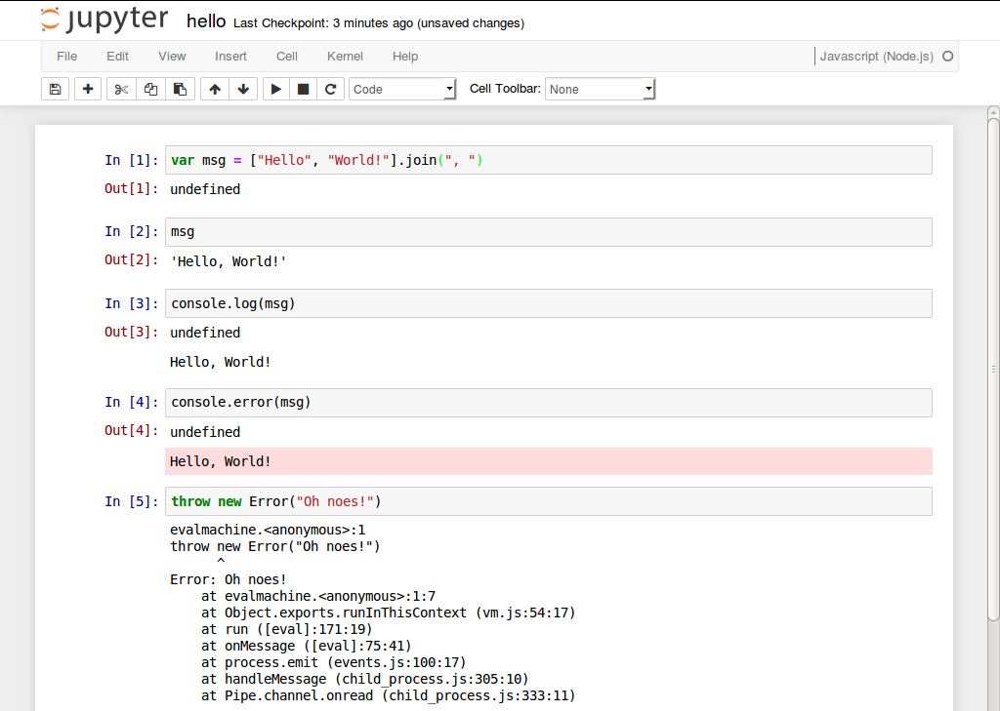

# IJavascript

[IJavascript](https://github.com/n-riesco/ijavascript) 是[Jupyter 笔记本](http://jupyter.org/)的 Javascript 内核.
Jupyter 笔记本将富文本文档（包括方程式，图形和视频）的创建与许多编程语言中的代码执行相结合。
代码的执行是通过实现[Jupyter 消息传递协议](http://jupyter-client.readthedocs.io/en/latest/messaging.html)的内核来执行的.

The IJavascript kernel executes Javascript code inside a [Node.js](https://nodejs.org/) session.
And thus, it behaves as the Node.js REPL does, providing access to the Node.js standard library and to any installed [npm](https://www.npmjs.com/) modules.

There are kernels available for [Python](http://ipython.org/notebook.html), [Julia](https://github.com/JuliaLang/IJulia.jl), [Ruby](https://github.com/minad/iruby), [Haskell](https://github.com/gibiansky/IHaskell) and [many other languages](https://github.com/jupyter/jupyter/wiki/Jupyter-kernels).

这是一个使用 IJavascript 内核的示例笔记本:



## 通告

- Starting with IJavascript v5.0.11, it is possible to customise the output of
  an object based on its type.
  See the documentation on [custom
  output](http://n-riesco.github.io/ijavascript/doc/custom.ipynb.html) for
  details.
- The use of `$$mimer$$` and `$$defaultMimer$$` to customise output is now
  deprecated.
- To avoid clutter in the global context, the use of `$$async$$`, `$$done$$`,
  `$$mime$$`, `$$html$$`, `$$svg$$`, `$$png$$` and `$$jpeg$$` has also been
  deprecated and replaced with the global object `$$`.

## 主要特点

- Run Javascript code inside a `Node.js` session
- [Hello, World!](http://n-riesco.github.io/ijavascript/doc/hello.ipynb.html)
- [Asynchronous
  output](http://n-riesco.github.io/ijavascript/doc/async.ipynb.html)
- [Custom output](http://n-riesco.github.io/ijavascript/doc/custom.ipynb.html)
  for `HTML`, `SVG`, `PNG`, ...
- [Autocompletion](http://n-riesco.github.io/ijavascript/doc/complete.md.html):
  press `TAB` to complete keywords and object properties
- [Object
  inspection](http://n-riesco.github.io/ijavascript/doc/inspect.md.html): press
  `Shift-TAB` to inspect an object and show its content or, if available, its
  documentation

## 安装

IJavascript is distributed as an [npm](https://www.npmjs.com/) package and thus
it requires:

- [Node.js](http://nodejs.org/)
- [npm](https://www.npmjs.com/)

Depending on your use, other [Jupyter tools](http://jupyter.org/) will be
necessary (e.g.
Jupyter notebook).
Note that IJavascript has been kept
backwards-compatibility with IPython v1, so that it's possible to use the
IPython notebook distributed in Ubuntu 14.04 LTS and Ubuntu 16.04 LTS.

For other platforms not listed below, or if you find any problems with the instructions above,
please, refer to the [installation
notes](http://n-riesco.github.io/ijavascript/doc/install.md.html).

### Ubuntu

To install IJavascript in Ubuntu 16.04 LTS, run:

```sh
sudo apt-get install nodejs-legacy npm ipython ipython-notebook
sudo npm install -g ijavascript
ijsinstall
```

### Windows (官方 Python 发行版)

In the command line:

```
pip3 install --upgrade pip
pip3 install jupyter
npm install -g ijavascript
ijsinstall
# Or run: %appdata%\npm\ijsinstall
```

Then you can run `jupyter notebook` in your terminal to load Jupyter Notebook.
When you create a new Jupyter Notebook, you should see the Javascript (Node)
kernel available.

### Windows (anaconda 分布)

Open the _Anaconda prompt_ and run:

```
conda install nodejs
npm install -g ijavascript
ijsinstall
```

Then you can run `jupyter notebook` in your terminal to load Jupyter Notebook.
When you create a new Jupyter Notebook, you should see the Javascript (Node)
kernel available.

### macOS

In macOS, [Homebrew](http://brew.sh/) and
[pip](https://pip.pypa.io/en/latest/installing) can be used to install
IJavascript and its prerequisites:

```sh
ruby -e "$(curl -fsSL https://raw.githubusercontent.com/Homebrew/install/master/install)"
brew install pkg-config node zeromq
sudo easy_install pip
pip install --upgrade pyzmq jupyter
npm install -g ijavascript
ijsinstall
```

## 用法

IJavascript provides 5 executables: `ijsinstall`, `ijsnotebook`, `ijsconsole`,
`ijskernel` and `ijs`.
Their purpose and basic use is described in the sections
below.
Please, refer to the [usage
notes](http://n-riesco.github.io/ijavascript/doc/usage.md.html) for further
details.

### `ijsinstall`: 内核规范安装程序

'ijsinstall` registers the IJavascript kernel with Jupyter, so that other tools
(e.g.
the Jupyter notebook) can invoke it.
The following command flags are
recognised:

```
--debug                   enable debug messages
--help                    show this help
--hide-undefined          do not show undefined results
--install=[local|global]  install kernel for current user or globally
--protocol=version        set messaging protocol version, e.g.
5.0
--show-undefined          show undefined results
--spec-path=[none|full]   set whether kernel spec uses full paths
--startup-script=path     run script on kernel startup
                          (path can be a file or a folder)
--version                 show kernel version
--versions                show kernel and library versions
--working-dir=path        set kernel working directory
                          (default = current working directory)
```

### `ijsnotebook`: 笔记本

运行`ijsinstall`后，Jupyter 笔记本用户可以像往常一样调用 Jupyter 笔记本。
提供`ijsnotebook`是为了方便第 3 版之前的 IPython 笔记本用户。
`ijsnotebook`是`ipython notebook`的包装器。
它扩展了`ipython notebook`接受的命令标志，如下所示:

```
--help                        show IJavascript and notebook help
--ijs-debug                   enable debug messages
--ijs-help                    show this help
--ijs-hide-undefined          do not show undefined results
--ijs-install=[local|global]  install kernel for current user or globally
--ijs-protocol=version        set protocol version, e.g.
5.0
--ijs-show-undefined          show undefined results
--ijs-spec-path=[none|full]   set whether kernel spec uses full paths
--ijs-startup-script=path     run script on startup
                              (path can be a file or a folder)
--ijs-working-dir=path        set kernel working directory
                              (default = current working directory)
--version                     show kernel version
--versions                    show kernel and library versions
```

### `ijsconsole`: 控制台

为了方便用户提供`ijsconsole`作为`ipython console`的包装。
可识别以下命令标志:

```
--help                        show IJavascript and notebook help
--ijs-debug                   enable debug messages
--ijs-help                    show this help
--ijs-hide-undefined          do not show undefined results
--ijs-install=[local|global]  install kernel for current user or globally
--ijs-protocol=version        set protocol version, e.g.
5.0
--ijs-show-undefined          show undefined results
--ijs-spec-path=[none|full]   set whether kernel spec uses full paths
--ijs-startup-script=path     run script on startup
                              (path can be a file or a folder)
--ijs-working-dir=path        set kernel working directory
                              (default = current working directory)
--version                     show kernel version
--versions                    show kernel and library versions
```

### `ijskernel`: 内核

`ijskernel`是由 Jupyter 工具（例如笔记本）调用的可执行文件，它出现在`ijsinstall`为 IJavascript 创建的内核规范中。
除非要创建自定义内核规范，否则不需要此命令。

```
Usage:
    ijskernel [options] connection_file

Options:
    --debug                           enable debug messages
    --hide-undefined                  do not show undefined results
    --protocol=Major[.minor[.patch]]  set protocol version, e.g.
5.0
    --session-working-dir=path        set session working directory
    --show-undefined                  show undefined results
    --startup-script=path             run script on startup
					  (path can be a file or a folder)
```

### `ijs`: 弃用的 CLI

`ijs` is provided for backwards-compatibility.
It will be removed in the next
major-version update.
Please, use `ijsinstall` or `ijsnotebook` instead.

## 捐款

First of all, thank you for taking the time to contribute.
Please, read
[CONTRIBUTING](http://n-riesco.github.io/ijavascript/contributing.html) and use
the [issue tracker](https://github.com/n-riesco/ijavascript/issues) for any
contributions: support requests, bug reports, enhancement requests, pull
requests, submission of tutorials...

## TODO

See the [issue tracker](https://github.com/n-riesco/ijavascript/issues) and the TODO list in the packages [jp-kernel](https://github.com/n-riesco/jp-kernel) and [NEL](https://github.com/n-riesco/jp-kernel) for additional items.
